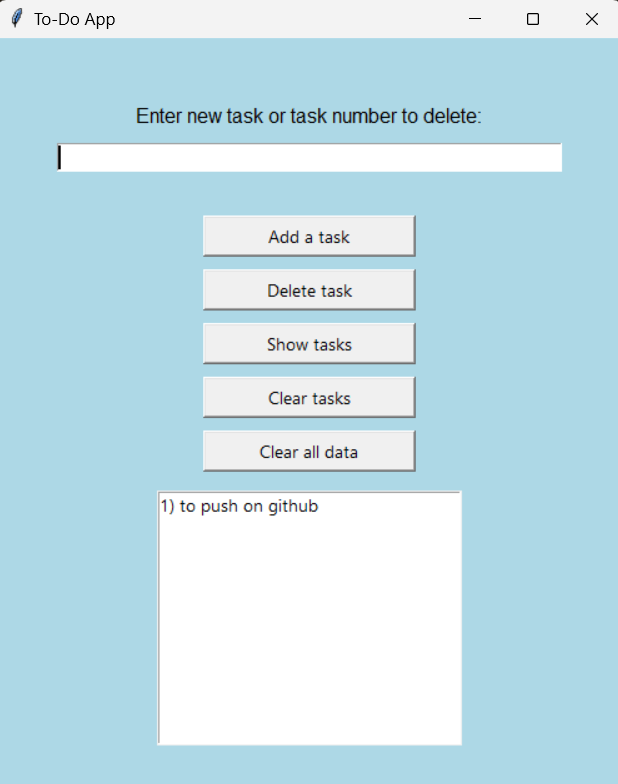

# Desktop Todo Application

> **Note:** This is an archived / legacy project created some time ago and uploaded here for history and reference.

A lightweight desktop Todo application built with Python. It allows users to create, track, and manage daily tasks efficiently with local file persistence.

## 🖼️ Preview



## 🚀 Features

- **Task Management**: Add, view, and organize daily tasks.
- **Local Persistence**: Automatically saves and loads tasks from a local `.txt` storage file.
- **Custom UI**: Uses a custom `.ico` file for application branding.

## 📋 Prerequisites

- **Python 3.8+**

## 🛠️ Getting Started

1. **Clone this repository:**
   ```bash
   git clone [https://github.com/DmytroKuda/to-do-app.git](https://github.com/DmytroKuda/to-do-app.git)
   cd YOUR_REPO_NAME